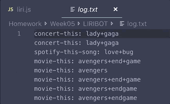
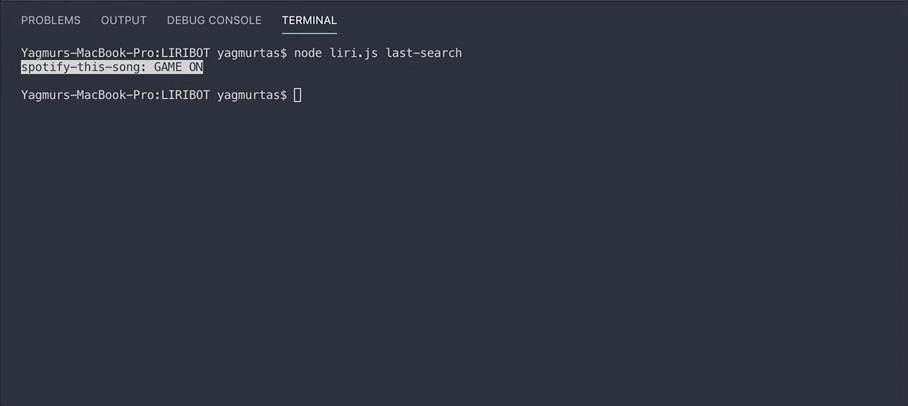
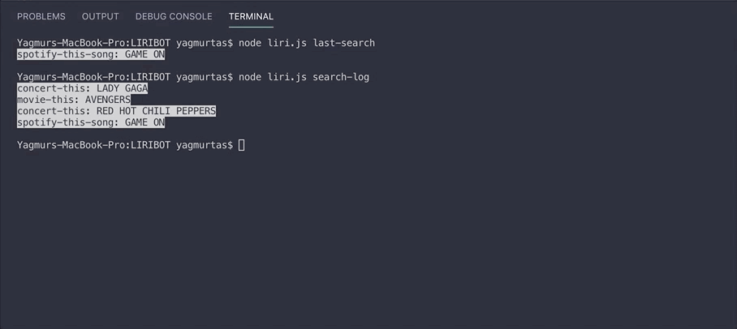

# LIRIBOT
### :octocat: An intelligent bot made with node.js. 


LIRI is a _Language Interpretation and Recognition Interface_, which is a **command line node app** that takes in parameters and gives you back data.

Liri can give you **information** about:
* approaching _concert dates_ and places of the groups you like.
* the _movies_ you like.
* _songs_ you like.

## How It Works

Applications uses 3 different API's and brings the user specific data:

1. For the information about movies it uses [OMDP API](http://www.omdbapi.com/).
2. For the information about songs, it uses [Spotify API](https://developer.spotify.com/documentation/web-api/reference/). For this function to work, the user himself/herself must have an API key of their own.
3. For the information about concerts, it uses [Bands in Town API](https://www.artists.bandsintown.com/bandsintown-api).

## Usage

1. `node liri.js concert-this <artist/band name here>`

   :curly_loop: This will render the following information about each event to the terminal:
    ```
     * Name of the venue
     * Venue location
     * Date of the Event
    ```
    

2. `node liri.js spotify-this-song '<song name here>'`

   :curly_loop: This will show the following information about the song in your terminal/bash window
    ```
     * Artist(s)
     * The song's name
     * A preview link of the song from Spotify
     * The album that the song is from
    ```
    

   * If no song is provided then the program will default to "The Sign" by Ace of Base.

    

3. `node liri.js movie-this '<movie name here>'`

   :curly_loop: This will output the following information to your terminal/bash window:

    ```
     * Title of the movie.
     * Year the movie came out.
     * IMDB Rating of the movie.
     * Rotten Tomatoes Rating of the movie.
     * Country where the movie was produced.
     * Language of the movie.
     * Plot of the movie.
     * Actors in the movie.
    ```
    

   * If you don't type a movie in, the program will output data for the movie 'Mr. Nobody.'
    
    

4. `node liri.js do-what-it-says`

    :curly_loop: This will prompt you about the action you want to take, and your search query.
    * It will render the answers depending on the action you take.

        

        

        

5. `node liri.js last-search`

    :curly_loop: The program automatically creates a random.txt file and keeps your last function and search parameter inside.
    * last-search will bring you the last function and search parameter.

        

    * :bangbang: **Warning:** The program also creates a log.txt file and logs all of your search parameters.

    

6. `node liri.js search-log`

    :curly_loop: This command prints the search history from log.txt file in your console.

    

7. `node liri.js clear-data`

    :curly_loop: When user is finished using the program, they can delete the log.txt and random.txt files by using this command.
    * Be careful with this command! When it's deleted, you can't get your search information back.

    


